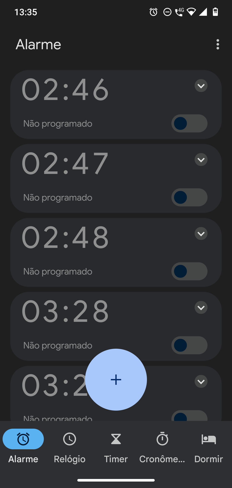
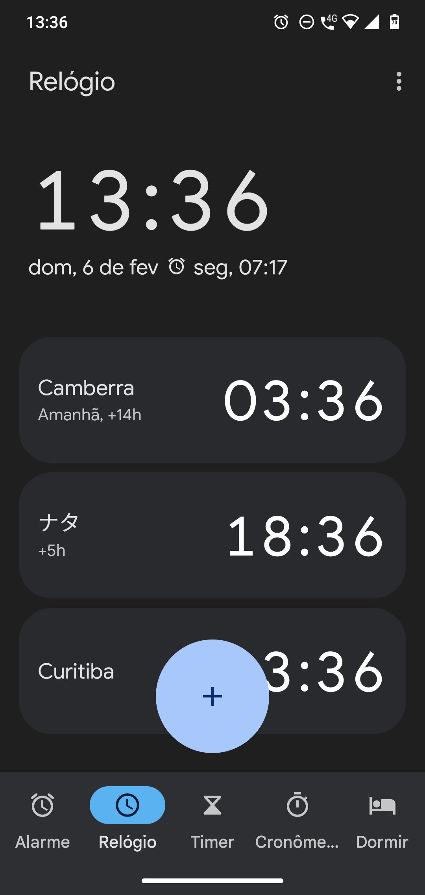
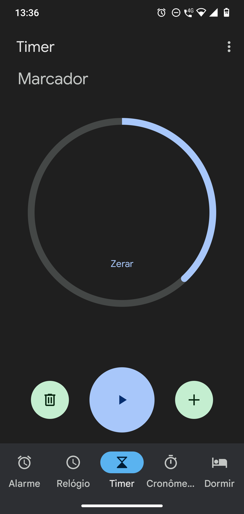
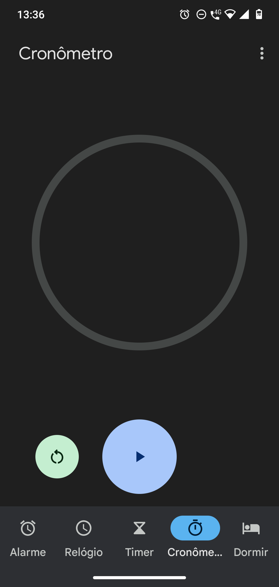
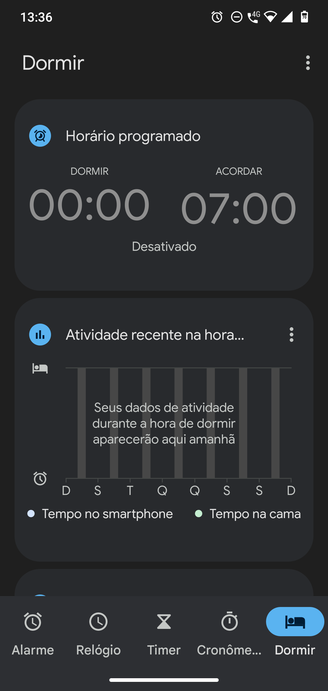

# AndroidWatch

This project aims to be a clone  of android watch

##Design guide 

<h3>Alarm Screen</h3>

In this screen the user should be able to add a new card in the + button
This card will define the hour of the alarm. More details about the card in the components section.

<h3>Clock Screen</h3>
In this screen the user should be able to see the hour in different timezones.
In the + button the user will add a new card that should display the hour in the especifield timezone.

<h3>Timer Screen</h3>
In this screen the user should be able to set a timer.
The user will see the progression of the timer in the timerComponent, that should behave like a progress bar.
The user shoud be able to enable a sound to play when the counter sets to 0.

<h3>StopWatch Screen</h3>

In this screen the user should be able to start a stopwatch.
The user sould be able to see the time passing, make turns, pause and stop the timer.

<h3>Sleep Screen</h3>

Maybe this sreen will not be implemented, Im not sure yet.
